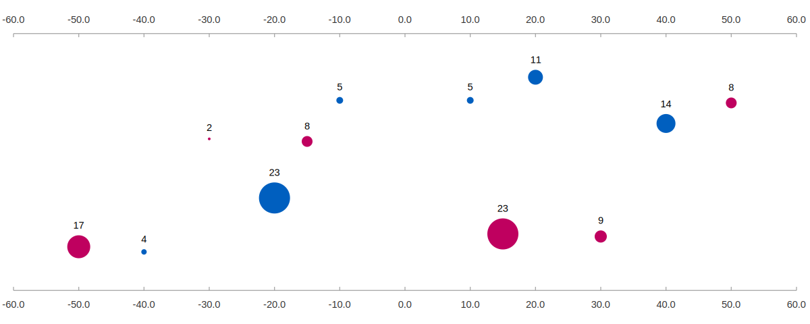
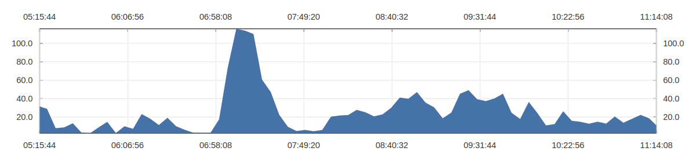
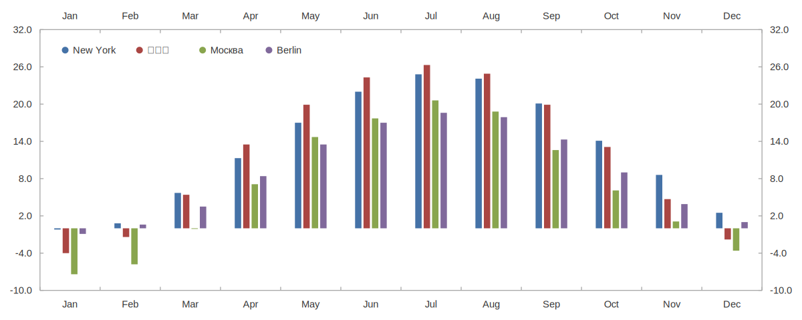
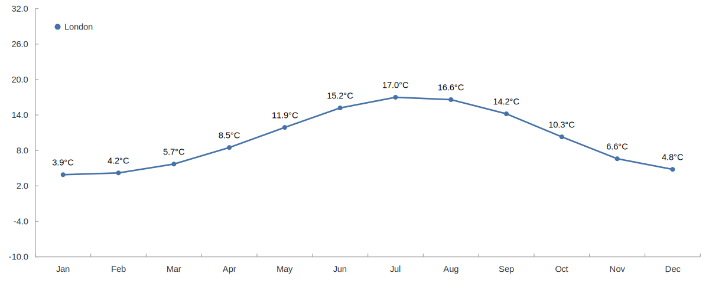
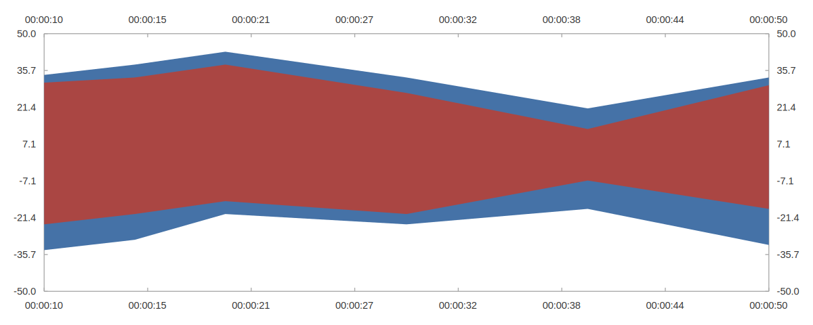

PlotFX
======

`plotfx` is a standalone tool for creating charts and other data-driven graphics.

Charts can be customized using a lightweight syntax that is very similar to CSS.
You can run PlotFX from the command line, where it generates SVG, PNG and PDF
output files. Additionally, you can embed it into your own application using the
C API.

PlotFX is partially based on ideas from the "Grammar of Graphics" [0].
One of the main goals for PlotFX is that creating charts should be quick, simple
and fun.

**WARNING**: The project is currently a work-in-progress. I'm currently working
on removing the old SQL chart specification language and replacing it with the
new CSS-like syntax. This might take a while...

[Examples](https://plotfx.org/examples) |
[Documentation](https://plotfx.org/reference)

Getting Started
---------------

Here is how to create a simple line chart using plotfx:

    $ plotfx --in example_chart.ptx --out example_chart.svg

Output File (`example_chart.svg`):

Input File (`example_chart.ptx`):

    data: csv('tests/testdata/city_temperatures.csv');
    x: month;
    y: temperature;
    group: city;

    scale-y-min: -10;
    scale-y-max: 32;

    layer {
      type: lines;
      stroke: 2pt;
    }

    legend {
      position: top left inside;
    }

For more examples, please see [the examples page](https://plotfx.org/examples).

Building
--------

To build PlotFX, you need an up-to-date C++ compiler, cmake, libharfbuzz and
libfreetype. Run:

    $ cmake .
    $ make

To install the `plotfx` binary into your system, run `make install`:

    $ make install

To run the test suite, run `make test`:

    $ make test

Examples
--------

Here are some more examples of plots generated by PlotFX:

<table>
  <tr>
    <td width="50%">
      
    </td>
    <td width="50%">
      
    </td>
  </tr>
  <tr>
  </tr>
  <tr>
    <td width="50%">
      
    </td>
    <td width="50%">
      
    </td>
  </tr>
  <tr>
  </tr>
  <tr>
    <td width="50%">
      
    </td>
    <td width="50%">
      
    </td>
  </tr>
</table>

For more examples, please see [the examples page](https://plotfx.org/examples).

Acknowledgements
----------------

PlotFX is the successor of the FnordMetric ChartSQL project by the same authors.

Parts of the new chart specification syntax and semantics were inspired by ideas
from the "Grammar of Graphics" [0] and the ggplot2 project.

[0] Wilkinson, L. (1999). The Grammar of Graphics (Springer)

License
-------

    The PlotFX License (https://plotfx.org)
    Copyright (c) 2018, Paul Asmuth, Laura Schlimmer
    All rights reserved.

    Redistribution and use in source and binary forms, with or without
    modification, are permitted provided that the following conditions are met:

    * Redistributions of source code must retain the above copyright notice, this
      list of conditions and the following disclaimer.

    * Redistributions in binary form must reproduce the above copyright notice,
      this list of conditions and the following disclaimer in the documentation
      and/or other materials provided with the distribution.

    * Neither the name of the copyright holder nor the names of its
      contributors may be used to endorse or promote products derived from
      this software without specific prior written permission.

    THIS SOFTWARE IS PROVIDED BY THE COPYRIGHT HOLDERS AND CONTRIBUTORS "AS IS"
    AND ANY EXPRESS OR IMPLIED WARRANTIES, INCLUDING, BUT NOT LIMITED TO, THE
    IMPLIED WARRANTIES OF MERCHANTABILITY AND FITNESS FOR A PARTICULAR PURPOSE ARE
    DISCLAIMED. IN NO EVENT SHALL THE COPYRIGHT HOLDER OR CONTRIBUTORS BE LIABLE
    FOR ANY DIRECT, INDIRECT, INCIDENTAL, SPECIAL, EXEMPLARY, OR CONSEQUENTIAL
    DAMAGES (INCLUDING, BUT NOT LIMITED TO, PROCUREMENT OF SUBSTITUTE GOODS OR
    SERVICES; LOSS OF USE, DATA, OR PROFITS; OR BUSINESS INTERRUPTION) HOWEVER
    CAUSED AND ON ANY THEORY OF LIABILITY, WHETHER IN CONTRACT, STRICT LIABILITY,
    OR TORT (INCLUDING NEGLIGENCE OR OTHERWISE) ARISING IN ANY WAY OUT OF THE USE
    OF THIS SOFTWARE, EVEN IF ADVISED OF THE POSSIBILITY OF SUCH DAMAGE.
