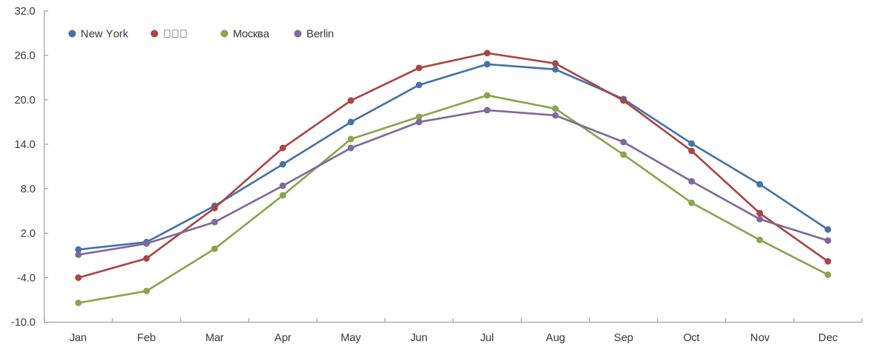

PlotFX
======

`plotfx` is a command line tool for creating charts from CSV files. It supports a
number of different plot types and other diagrams. Charts can be customized
using a configuration language similar to CSS.

[Examples](https://github.com/plotfx/plotfx/tree/master/examples) |
[Documentation](https://plotfx.org/)

Example
-------

Here is how to generate a simple line chart using plotfx:

    $ plotfx -in example_chart.plot -out example_chart.svg

Output File (`example_chart.svg`):

Input File (`example_chart.plot`):

    plot {
      axis-top: off;
      axis-right: off;

      ymin: -10;
      ymax: 32;

      series {
        title: "New York";
        point-size: 3.3pt;
        xs: csv(testdata/city_temperatures.csv, month);
        ys: csv(testdata/city_temperatures.csv, new_york);
      }

      series {
        title: "北京市";
        point-size: 3.3pt;
        xs: csv(testdata/city_temperatures.csv, month);
        ys: csv(testdata/city_temperatures.csv, bejing);
      }

      # ...
    }

For more examples, please see [the examples page](https://github.com/plotfx/plotfx/tree/master/examples).

Building
--------

To build PlotFX, you need an up-to-date C++ compiler, cmake, harfbuzz, libpng
and libcairo. Run:

    $ cmake .
    $ make

To run the test suite, run `make check`:

    $ make check

More Examples
-------------

Here are some more examples of plots generated by PlotFX:

<table>
  <tr>
    <td width="50%">
      
    </td>
    <td width="50%">
      
    </td>
  </tr>
  <tr>
  </tr>
  <tr>
    <td width="50%">
      
    </td>
    <td width="50%">
      
    </td>
  </tr>
  <tr>
  </tr>
  <tr>
    <td width="50%">
      
    </td>
    <td width="50%">
      
    </td>
  </tr>
</table>

For more examples, please see [the examples page](https://github.com/plotfx/plotfx/tree/master/examples).

License
-------

    Copyright (c) 2018, Paul Asmuth, Laura Schlimmer
    All rights reserved.

    Redistribution and use in source and binary forms, with or without
    modification, are permitted provided that the following conditions are met:

    * Redistributions of source code must retain the above copyright notice, this
      list of conditions and the following disclaimer.

    * Redistributions in binary form must reproduce the above copyright notice,
      this list of conditions and the following disclaimer in the documentation
      and/or other materials provided with the distribution.

    * Neither the name of the copyright holder nor the names of its
      contributors may be used to endorse or promote products derived from
      this software without specific prior written permission.

    THIS SOFTWARE IS PROVIDED BY THE COPYRIGHT HOLDERS AND CONTRIBUTORS "AS IS"
    AND ANY EXPRESS OR IMPLIED WARRANTIES, INCLUDING, BUT NOT LIMITED TO, THE
    IMPLIED WARRANTIES OF MERCHANTABILITY AND FITNESS FOR A PARTICULAR PURPOSE ARE
    DISCLAIMED. IN NO EVENT SHALL THE COPYRIGHT HOLDER OR CONTRIBUTORS BE LIABLE
    FOR ANY DIRECT, INDIRECT, INCIDENTAL, SPECIAL, EXEMPLARY, OR CONSEQUENTIAL
    DAMAGES (INCLUDING, BUT NOT LIMITED TO, PROCUREMENT OF SUBSTITUTE GOODS OR
    SERVICES; LOSS OF USE, DATA, OR PROFITS; OR BUSINESS INTERRUPTION) HOWEVER
    CAUSED AND ON ANY THEORY OF LIABILITY, WHETHER IN CONTRACT, STRICT LIABILITY,
    OR TORT (INCLUDING NEGLIGENCE OR OTHERWISE) ARISING IN ANY WAY OUT OF THE USE
    OF THIS SOFTWARE, EVEN IF ADVISED OF THE POSSIBILITY OF SUCH DAMAGE.
